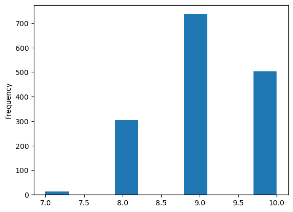

**1. Heading tag in markdown**:To create a heading, add number signs (#) in front of a word or phrase. The number of number signs you use should correspond to the heading level.

# heading-1

## heading-2

### heading-3

#### heading-4

##### heading-5

###### heading-6

**2.Block of words**
   
This is the first list item.

Here's the second list item.

> A blockquote would look great below the second list item.

**3.line breaks (2 way)**

**way-01**

this is first line.

this is a second line 

**way-02**

this is first line.\
this is a second line

**4.combine two things** block of word and heading

>## heading-2

# face of text

**1.Bold**:Add double underscore(__) or asterisk(**)before and after a word or phrase.

**This is a markdown tutorial**

**2.italic**:Add single underscore(_) or asterisk(*) before and after a word or phrase.

*This is a markdown tutorial*

**3.Bold & italic**: Add three underscore(___) or asterisk(***) before and after a word or phrase.

***This is a markdown tutorial***

5.indenting

Add > before word or phrase 
>This is a markdown tutorial

**bulltes**: Add - or * with space before word or phrase

- This is a markdown tutorial

* This is a markdown tutorial

**For sub bulltes**: Enter tab before * sign 

- This is a markdown tutorial

    * This is a markdown tutorial
 
Enter the number followed by a space 

### 7.Number list

1. This is a markdown tutorial
2. This is a markdown tutorial
3. This is a markdown tutorial

**Line brake**:End a line with two or more space,and then enter and type second line.

This is a first line.  

This is a second  line. 

**Horizontal line**:use three or more underscore(___) or asterisk(***) or dash(---) on a line by them selves

This is a first line.
___

This is a second  line.

**link and hyper link**:Add exclamation mark(!),followed by alt text in the text in brackets,and the path or url to the image asset in parentheses.

<https://github.com/Bibek-9078>

[This is my my linkdin here](https://www.linkedin.com/in/bibek-kumar-panda/)

**image and video**

